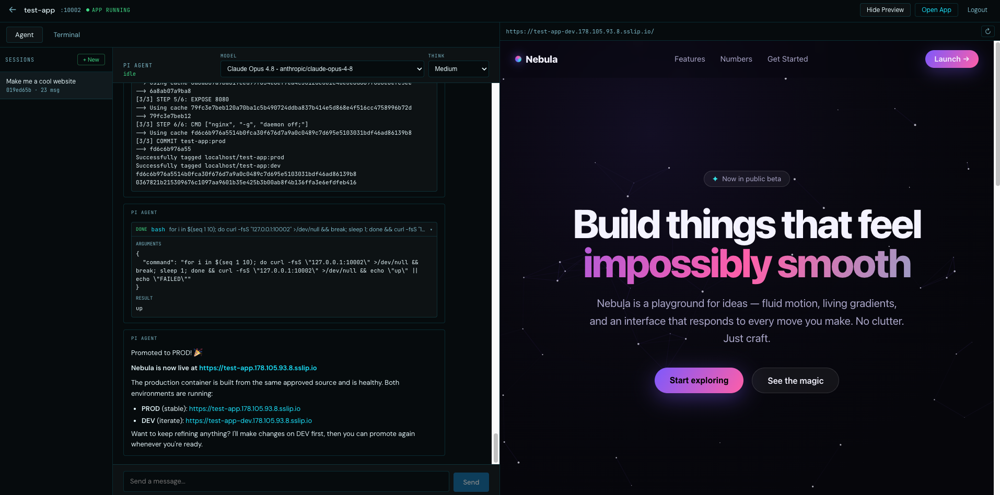

# Appx

Agentic Application Proxy — a self-hostable tool to build and host apps with AI agents powered by [Pi](https://pi.dev).



## What it does

Appx is a management shell for running coding agents on a remote server. It provides authentication, TLS termination, a web dashboard, and a reverse proxy — so you can manage projects, chat with agents, and access agent-built apps from a browser over HTTPS.

Appx works together with two sibling projects:

- **[agent-server](https://github.com/appx-org/agent-server)** — the HTTP/SSE agent runtime that wraps Pi. It owns project identity, on-disk project directories, session transcripts, models, and credentials. Appx proxies session traffic to it.
- **[agent-client](https://github.com/appx-org/agent-client)** — the TypeScript SDK and chat UI that talks to the agent-server `/v1` contract. Appx's frontend consumes it against the same-origin `/api/pi` mirror.

## Architecture

```
Browser
  └── HTTPS (single port)
        ├── /              React SPA (embedded in binary)
        ├── /api/*         REST API (auth, projects, settings)
        ├── /api/pi/*       → agent-server /v1 mirror (agent-client SDK; project-scoped sessions + models)
        ├── /api/agent/*    → Pi agent-server shared auth/model proxy
        └── <project>.<domain>   Reverse proxy → agent-built apps
```

Appx itself is a single Go binary; the React frontend is compiled and embedded at build time, and state lives in a SQLite database on disk.

Pi is the agent runtime. In production appx runs as the `appx` systemd service and supervises an **outer container** that holds agent-server + Pi + rootless podman; agent-server (published on loopback `127.0.0.1:4001`) owns project identity, directories, and sessions while sharing one set of Pi credentials, and Appx proxies session traffic to it. In local dev agent-server is run by hand and appx points at it via `APPX_AGENT_SERVER_URL` (no systemd, no container).

**Auth model**: single user, password login, session cookie. On first run a random password is generated and written to `{data-dir}/.appx-internals/initial_password`.

**TLS**: self-signed ECDSA P-256 certificate auto-generated on first run, auto-renewed 7 days before expiry. For production, use `APPX_DOMAIN` + `CLOUDFLARE_API_TOKEN` for Let's Encrypt.

## Documentation

- **[Self-Hosting](docs/readme/self-hosting.md)** — prerequisites, the from-scratch install, provider secrets, updating, verification, troubleshooting, and known gotchas (incl. Amazon Bedrock).
- **[Networking & TLS](docs/readme/networking-and-tls.md)** — subdomain routing via sslip.io and automatic Let's Encrypt certificates.
- **[Storage & Isolation](docs/readme/storage-and-isolation.md)** — where state lives (host data dir + Docker volumes), what survives a container restart, the user/isolation model, and caveats.
- **[Local Development](docs/readme/local-development.md)** — the no-systemd, no-container dev flow (run agent-server by hand + `appx --http`).
- **[CLAUDE.md](CLAUDE.md)** — architecture details and development conventions.

## Prerequisites (production)

A Linux host (Ubuntu 24.04 LTS recommended), `git`, **rootful Docker**, and the sibling [`agent-server`](https://github.com/appx-org/agent-server) + [`agent-client`](https://github.com/appx-org/agent-client) repos checked out next to `appx`. Then:

```bash
cd /srv/appx
sudo ./deploy/bootstrap.sh
```

See **[Self-Hosting](docs/readme/self-hosting.md)** for the complete, ordered steps.
